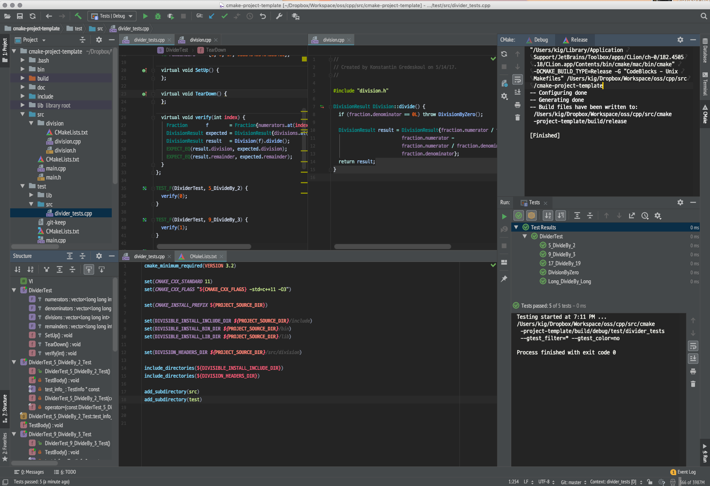

# IntellGraph

A deep learning framework in C++


# Installation
### Building The Project

#### Git Clone

First we need to check out the git repo:

```bash
$ cd ${insert your workspace folder here}
$ git clone https://github.com/kigster/cmake-project-template my-project
$ cd my-project
$ git submodule init && git submodule update
```

Now we should be in the project's top level folder. 

#### Project Structure

There are three empty folders: `lib`, `bin`, and `include`. Those are populated by `make install`.

The rest should be obvious: `src` is the sources, and `test` is where we put our unit tests.

Now we can build this project, and below we show three separate ways to do so.

#### Building Manually

```bash
$ rm -rf build/manual && mkdir build/manual
$ cd build/manual
$ cmake ../..
$ make && make install
$ cd ../..

# Run the tests:
$ bin/divider_tests 

# Run the binary:
$ bin/divider 234 5431
```

####  Building Using the Script

There is a handy BASH script (used by the Travis CI) that you can run locally. It builds the project, and runs all the tests

```bash
./run.sh
```

#### Building in CLion

> **NOTE**: Since JetBrains software [does not officially support git submodules](https://youtrack.jetbrains.com/issue/IDEA-64024), you must run `git submodule init && git submodule update` before starting CLion on a freshly checked-out repo.

> **NOTE**: We recommend that you copy file `.idea/workspace.xml.example` into `.idea/workspace.xml` **before starting CLion**. It will provide a good starting point for your project's workspace.

Assuming you've done the above two steps, you can start CLion, and open the project's top level folder. CLion should automatically detect the top level `CMakeLists.txt` file and provide you with the full set of build targets.

Select menu option **Run ➜ Build**, and then **Run ➜ Install**.



The above screenshot is an example of CLion with this project open.


